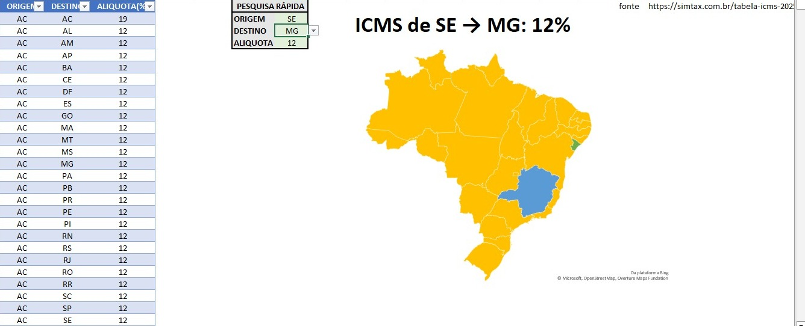
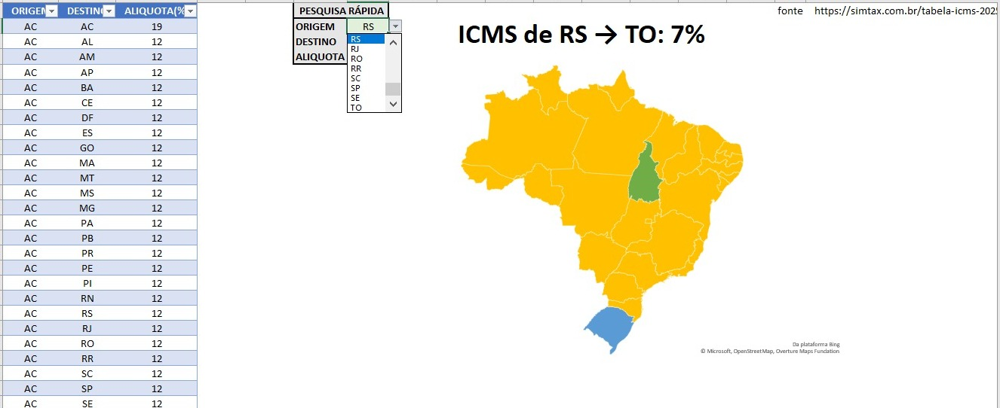

# Planilha Interativa de Consulta de Tributos

Esta é uma **planilha interativa em Excel** que permite consultar rapidamente alíquotas de ICMS entre estados brasileiros e visualizar a informação em um mapa.

No momento, a ferramenta contempla apenas o **ICMS**, mas futuramente planejo incluir outros impostos.

---

## Funcionalidades

- Seleção de **estado de origem** e **estado de destino** via dropdown.
- Consulta automática da **alíquota de ICMS**.
- Visualização em **mapa do Brasil** com os estados de origem e destino destacados.
- Fácil de usar, sem necessidade de fórmulas manuais.

---

## Como usar

1. Abra o arquivo `ALIQUOTA_ICMS.xlsx`.
2. Na aba **ORIGEMDESTINO**, selecione os estados nos dropdowns.
3. A alíquota será exibida automaticamente.
4. Confira o mapa que destaca os estados de origem (azul) e destino (verde).

---

## Arquivos

- `ALIQUOTA_ICMS.xlsx` — planilha principal com as alíquotas de ICMS.
- `img1.jpeg` — print do mapa e dropdowns.
- `img2.jpeg` — print mostrando a alíquota calculada.

---

## Tecnologias usadas

- **Microsoft Excel 2019**  
- Fórmulas matriciais (`ÍNDICE` + `CORRESP`)  
- Gráfico de mapa preenchido

---

**Autor:** Jean Vyctor
